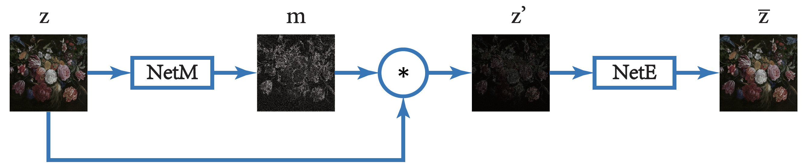
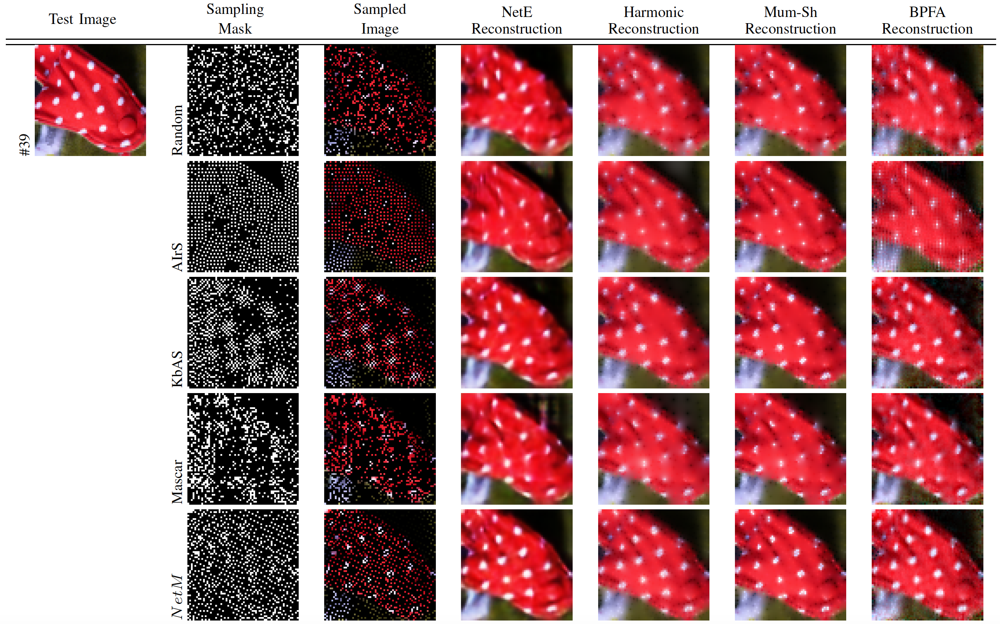
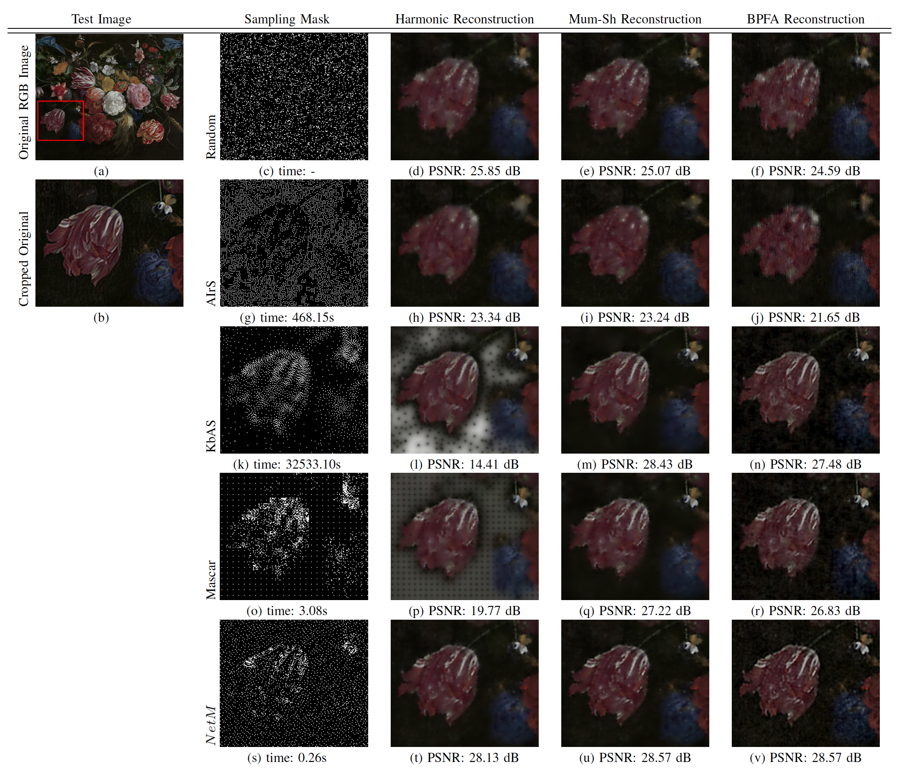

# Adaptive Image Sampling using Deep Learning
A PyTorch implementation of the paper:
[Adaptive Image Sampling using Deep Learning and its Application on X-Ray Fluorescence Image Reconstruction] [[Arxiv Preprint]](https://arxiv.org/abs/1812.10836) [[IEEE Transactions on Multimedia Preprint]](https://ieeexplore.ieee.org/document/8930037) 

## Introduction



Pipeline for adaptive sampling mask generation utilizing CNNs.



Visual Comparison of the reconstructed images using random, AIrS, KbAS, and NetM sampling masks at sampling rate c = 0.2. The first column is
the input test image and the second column is the sampling mask, either random, AIrS, KbAS, or NetM, the third column is the sampled image obtained by the
sampling mask, and the rest of the columns are the reconstruction results of NetE Inpainting, Harmonic Inpainting, Mumford-Shah Inpainting,
and BPFA inpainting respectively.



Visualization of sampling and inpainting result of the “Bloemen en insecten” painting. (a) original RGB image with red bounding box. (b) region
inside the bounding box of (a) for visualization purposes. (c), (g), (k), (o) and (s) random, AIrS, KbAS, Mascar and NetM sampling masks respectively. (d),
(h), (l), (p) and (t) reconstruction results of each sampling mask using Harmonic algorithms. (e), (i), (m), (q) and (u) reconstruction results of each sampling
mask using Mumford-Shah algorithm. (f), (j), (n), (r) and (v) reconstruction results of each sampling mask using BPFA algorithm. Computation time of each
sampling mask and PSNR of the entirety of each reconstructed images are also shown.

## Requirements
- [Anaconda](https://www.anaconda.com/download/)
- [PyTorch](https://pytorch.org/)
- tqdm
```
pip install tqdm
```
- opencv
```
conda install -c conda-forge opencv
```
- [tensorboard_logger](https://github.com/TeamHG-Memex/tensorboard_logger)
```
pip install tensorboard_logger
```
- h5py
```
conda install h5py
```

## Datasets

### Train and Val Dataset
The train and val datasets are sampled from [ImageNet](http://www.image-net.org/).
Train dataset has 100000 images. Val dataset has 1000 images.
Download the datasets from [here](https://drive.google.com/file/d/1RNfvuZKdf8MZAb1zzVgsFSlX36oc1uPA/view?usp=sharing), 
and then extract it into `$data` directory. Modify the path of `$data` directory in line#48 of file train_NetE.py and line#48 of file train_NetM.py.

### Test Image Dataset
The test image dataset are sampled from [ImageNet](http://www.image-net.org/). It contains 100 images. It is stored in file data_val_100.h5 .

## Usage

### Train NetE

Run
```
python train_NetE.py
```
to train the image inpainting network NetE.

### Train NetM

After NetE is trained, modify the file name of trained NetE in line#29 of file train_NetM.py and run
```
python train_NetM.py
```
to train the adaptive image sampling network NetM.

To visualize the training process, run
```
tensorboard --logdir tensorBoardRuns
```

### Test NetE
```
python test_NetE_h5.py
```
The output reconstructed images are in `results/netE_results` directory.

### Test NetM
```
python test_NetM_h5.py
```
The output reconstructed images are in `results/netM_results` directory.

